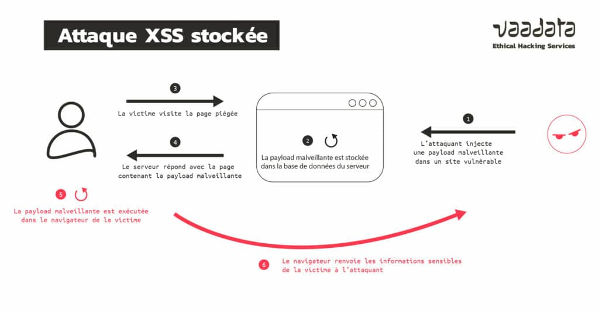
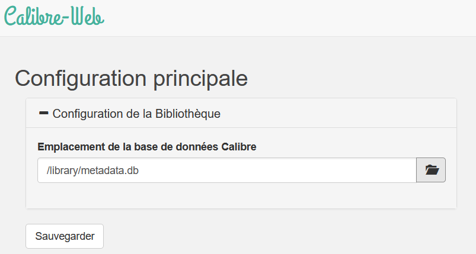

# CVE-2024-39123

## Indiquer quel est le service ou le programme compromis, quel est le type de compromission

Le programme compromis est **Calibre**, un gestionnaire de bibliothèques numériques largement utilisé pour :

- La conversion de livres numériques entre différents formats.
- Le catalogage et l'organisation de bibliothèques numériques.
- L'édition et la personnalisation des métadonnées.
- La visualisation et la lecture de livres électroniques.

## Type de compromission

Le type de compromission détecté dans ce programme est une **faille XSS (Cross-Site Scripting)**. Cette vulnérabilité permet à un attaquant de :

- Injecter du code malveillant dans des champs manipulés par l'application, comme les métadonnées des livres.
- Exploiter ce code lorsque ces données sont affichées dans l'interface utilisateur ou utilisées sans validation ni filtrage appropriés.



## Expliquer la vulnérabilité, décrire le mécanisme permettant de l’exploiter.


La vulnérabilité repose sur une **injection XSS stockée**, un type d'attaque qui exploite des champs dont les données :

- **Ne subissent pas de prétraitement approprié**, comme la validation ou le filtrage, avant d'être utilisées.
- **Sont affichées ou exécutées directement** dans le code ou la page web sans mesures de sécurité.

Cette faille, référencée sous le code  [CVE-2024-39123](https://www.cvedetails.com/cve/CVE-2024-39123/), permet aux attaquants d'exploiter des failles présentes dans des champs utilisateur insuffisamment protégés.

En l'absence de précautions, un attaquant peut injecter du code malveillant dans ces champs. Ce code est alors stocké sur le serveur (dans la base de données) et se retrouve **inclus dans le contenu dynamique** de la page.

Lorsqu'un utilisateur légitime accède à cette page ou à ces informations compromises, le code malveillant s'exécute directement sur sa machine. Ce mécanisme peut permettre à l'attaquant de :

- **Voler des informations sensibles**, comme des cookies ou des identifiants.
- **Contrôler le navigateur** de la victime.
- **Mener d'autres actions malveillantes** à l'insu de l'utilisateur, compromettant gravement sa sécurité.

### Mécanisme d'exploitation

Pour exploiter cette vulnérabilité, un attaquant pourrait suivre les étapes suivantes :

1. **Modifier les métadonnées du livre numérique** :
   L'attaquant insère un script malveillant dans un champ spécifique, tel que le champ **comments** des métadonnées d'un fichier ePub. Par exemple :
   ```html
   <math>
       <mtext>
           <script>
               document.body.innerHTML = '<div style="position:fixed;top:0;left:0;width:100%;height:100%;background-color:black;z-index:9999;display:flex;align-items:center;justify-content:center;">
               <iframe src="https://www.youtube.com/embed/dQw4w9WgXcQ?autoplay=1&amp;loop=1" style="width:80%;height:80%;border:none;"></iframe>
               </div>';
           </script>
       </mtext>
   </math>
   ```

2. **Importer le fichier modifié dans une bibliothèque Calibre** :
   Une fois le fichier ePub modifié, il est ajouté à la bibliothèque numérique. Les métadonnées contenant le script sont alors accessibles via l'interface de gestion ou de lecture de Calibre.

3. **Exécution du code malveillant** :
   Lorsqu'un utilisateur ouvre ou consulte les détails du livre modifié, le script injecté s'exécute automatiquement. Cela peut provoquer diverses actions malveillantes, comme :
   - Afficher une page ou une vidéo non désirée.
   - Exfiltrer des données sensibles à l'insu de l'utilisateur.
## Cette faille concerne-t-elle des machines clientes ou des machines serveurs ?

Cette faille concerne principalement des machines clientes, car elle cible les utilisateurs qui accèdent à l'interface web ou à l'application. L'exécution du script malveillant se produit sur le navigateur du client, bien que le code soit stocké côté serveur.

## Architecture typique

Dans une architecture typique, voici les composants impliqués dans l'exploitation d'une faille XSS stockée :

- Serveur web hébergeant l'application Calibre ou tout autre service vulnérable à l'injection XSS. C'est ici que les données malveillantes sont stockées après l'injection.
- Client (navigateur) accédant à l'application web compromise, qui exécute le code malveillant injecté.
- Réseaux d'interconnexion (internet, VPN, etc.) reliant les clients au serveur.


L'attaque XSS se propage lorsque le client, en toute légitimité, récupère des données du serveur compromises par un attaquant.

## Cette description étant faite, et en tant qu’administrateur système sur un réseau contenant des machines pouvant être affectées que préconiseriez-vous au niveau du rapport pour : - limiter l’impact de l’exploitation de ces failles ? - empêcher qu’elles ne puissent être exploitées ?

Pour protéger un réseau contenant des machines vulnérables, voici les mesures à appliquer :

#### 1. **Nettoyer et Valider les Données Utilisateur**
- **Objectif** : Prévenir les injections et autres failles liées aux données utilisateur malveillantes.
- **Actions** :
  - Valider toutes les données utilisateur avant de les stocker ou de les afficher.
  - Nettoyer les entrées en échappant les caractères spéciaux.
  - Utiliser des bibliothèques dédiées pour la validation des entrées (ex. : bibliothèques de validation pour les formulaires et les requêtes API).
  - Mettre en œuvre des contrôles stricts sur les types de données acceptées.

#### 2. **Mettre en Place une Politique de Content Security Policy (CSP)**
- **Objectif** : Réduire les risques liés à l’exécution de scripts non autorisés.
- **Actions** :
  - Configurer une politique CSP stricte pour restreindre les sources de contenu et limiter les scripts pouvant être exécutés dans les navigateurs.
  - Autoriser uniquement les scripts provenant de sources de confiance.
  - Empêcher le chargement de contenu mixte en interdisant les connexions non sécurisées.

#### 3. **Limiter les Droits des Scripts et Cookies**
- **Objectif** : Réduire la surface d’attaque en contrôlant les privilèges des scripts et la gestion des cookies.
- **Actions** :
  - Configurer les cookies avec les attributs suivants :
    - `HttpOnly` : Empêche l’accès aux cookies via JavaScript.
    - `Secure` : Restreint l’envoi des cookies aux connexions HTTPS.
  - Limiter l’accès aux scripts en respectant le principe du moindre privilège.

#### 4. **Encourager les Mises à Jour Régulières**
- **Objectif** : Réduire les risques liés aux vulnérabilités non corrigées.
- **Actions** :
  - Maintenir à jour tous les logiciels utilisés sur le réseau.
  - Installer régulièrement les correctifs de sécurité fournis par les éditeurs.
  - Automatiser les mises à jour lorsque cela est possible pour éviter les oublis.


## Référencer parmi les bonnes pratiques, celles qu’il faudrait utiliser pour limiter cette menace.

Il faut appliquer le principe "zéro trust".Dans ce cas-là, ne jamais faire confiance aux données qui sont saisies par l'utilisateur.

- Validation côté serveur et côté client : Toujours valider les entrées, non seulement au niveau de l'interface utilisateur, mais aussi au niveau du serveur, pour s'assurer que seules des données sûres sont traitées.

- Échappement des données : Utiliser des fonctions d'échappement spécifiques au contexte (HTML, JavaScript, CSS, etc.) pour éviter les injections.

- Détection des intrusions : Mettre en place des systèmes de détection des intrusions (IDS) pour repérer toute tentative d'attaque XSS.

## S’il s’agit d’une faille issue d’un développement, indiquer ce qu’il aurait fallu mettre en place dans les équipes de développement pour limiter l’apparition d’une telle faille.

- Revue de code régulière : Effectuer des revues de code pour s'assurer qu'aucune entrée utilisateur non filtrée ne se retrouve dans la sortie.

- Tests automatisés de sécurité : Mettre en place des tests d'intégration et de sécurité qui vérifient les vulnérabilités XSS lors des builds CI/CD.

- Utilisation d’outils de scan de sécurité : Intégrer des outils comme OWASP ZAP dans le pipeline de développement pour détecter les vulnérabilités XSS avant la mise en production.

## Pour le produit étudié, définir une cible de sécurité (Utilisateurs, Biens à protéger, Menaces, fonctions de sécurité, …)

- Utilisateurs : Les utilisateurs finaux accédant à la bibliothèque numérique via Calibre.
- Biens à protéger : Les informations stockées dans la base de données, y compris les métadonnées des livres, les comptes utilisateurs, et les sessions actives.
- Menaces : Les attaquants exploitant les vulnérabilités XSS pour voler des informations ou exécuter des actions malveillantes.
- Fonctions de sécurité : Validation des entrées, gestion des sessions sécurisées, implémentation d'une CSP.

1. Utilisateurs

| Utilisateurs       |                                               Description                                                |
| ------------------ | :------------------------------------------------------------------------------------------------------: |
| Client             | Utilise Calibre via le protocol mis en place par Calibre pour gérer, consulter et télécharger des ebooks |
| Développeurs       |                               Les personnes chargées de concevoir Calibre                                |
| Client malveillant |                  Individus malveillants cherchant à réaliser une injection XSS stockée                   |

2. Biens à protéger

| Bien                                       |                                        Description                                         |
| ------------------------------------------ | :----------------------------------------------------------------------------------------: |
| Données personnelles et d'authentification | Les informations personnelles (email, nom, prénom, ...), les cookies et tokens de session. |
|                                            |                                                                                            |
| Systèmes des utilisateurs                  |                Préserver l'intégrité des systèmes clients et du navigateur                 |
| Confidentialité                            |                   Empêcher le vol d'informations privées ou personnelles                   |


3. Menaces

| Utilisateurs                           |                                                                                                        Description                                                                                                        |
| -------------------------------------- | :-----------------------------------------------------------------------------------------------------------------------------------------------------------------------------------------------------------------------: |
| Vol de données personnelles            |                                      Récupération des informations sensibles, comme des identifiants, mots de passe, cookies de session, ou des données de la bibliothèque numérique                                      |
| Exécution de code malveillant          |                                                                         Installation de malwares ou de keyloggers sur le système de l'utilisateur                                                                         |
| Phishing et redirections malveillantes | Redirection vers un site de phishing qui ressemble à un service légitime (par exemple, une fausse page de connexion) pour voler des informations personnelles, telles que des mots de passe ou des informations bancaires |
| Vol de session                         |                                         Si l'attaque XSS réussit à voler un cookie de session, l'attaquant pourrait prendre le contrôle de la session de l'utilisateur légitime.                                          |
| Phishing                               |                                                                        Récupérer des informations sensibles de l'utilisateur à des fins illégales                                                                         |

4. Fonctions de sécurité

| Utilisateurs                  |                                                                                  Description                                                                                  |
| ----------------------------- | :---------------------------------------------------------------------------------------------------------------------------------------------------------------------------: |
| Authentification forte        |                          Utiliser des mécanismes d'authentification robustes, comme l'authentification multi-facteurs pour éviter le vol de session                           |
| Validation des entrées        |                                                      Assainir les données utilisateur pour empêcher l'exécution de code                                                       |
| Échappement des sorties       |                                                       Encoder les caractères spéciaux pour prévenir l'exécution de code                                                       |
| Content Security Policy (CSP) | Mettre en place une CSP afin de restreindre les sources de contenu autorisées et empêcher l'exécution de scripts non sécurisés provenant de sources externes ou non vérifiées |

5. Périmètre (Environnement et hypothèses)

| Utilisateurs      |                              Description                              |
| ----------------- | :-------------------------------------------------------------------: |
| Calibre           |                    L'application qui est exploité                     |
| Interface Web     |     Le point d’entrée pour l’exploitation de cette vulnérabilité      |
| Machines clientes | Les utilisateurs qui accèdent à l’interface web via leurs navigateurs |
| Serveur           |   Machine hébergeant l'application et ses bibliothèques numériques    |
On prend pour hypothèse que Calibre est à la version 0.6.12 donc qu'il n'y a pas de mesure de sécurité contre les injections XSS stockées.

6. Liens entre menaces et fonctions de sécurité

| Menace / fonctions de sécurité | Authentification forte | Validation des entrées | Echappement des sorties | Content Security Policy |
| :----------------------------: | :--------------------: | :--------------------: | :---------------------: | :---------------------: |
|  Vol de données personnelles   |                        |           X            |            X            |                         |
|         Vol de session         |           X            |           X            |            X            |                         |
| Exécution de code malveillant  |                        |           X            |            X            |                         |
|            Phishing            |                        |           X            |            X            |            X            |
|   Redirection malveillantes    |                        |           X            |            X            |            X            |


## Pour cette faille proposer une expérimentation permettant de mettre en évidence la vulnérabilité et son exploitation :

## Expérimentation et mise en évidence de la vulnérabilité et de son exploitation
**Nous nous sommes inspirés de cet [exemple d'exploitation de la faille](https://www.exploit-db.com/exploits/52067) afin d'élaborer cette démonstration**


### Infrastructure utilisée


#### Serveur Calibre :
- Basé sur une image Python (3.10-slim).
- Installe Calibre Web et ses dépendances dans un environnement virtuel Python.
- Configure une bibliothèque contenant un ebook modifié pour inclure un script malveillant dans ses métadonnées.
- Expose le port 8083 pour permettre les interactions avec des clients.

#### Client :
- Utilise un navigateur web pour interagir avec l’interface exposée par le serveur Calibre.
- Permet de visualiser les métadonnées compromises et d’observer l’exécution du script injecté.

### Étapes principales

#### Construction du conteneur serveur :
1. Une image Docker est créée à partir de Python 3.10-slim.
2. Mise à jour et installation des dépendances requises.
3. Installation de Calibre Web dans un environnement virtuel Python.
4. Configuration de la bibliothèque :
   - Téléchargement d’un ebook de démonstration.
   - Modification des métadonnées pour inclure un script XSS malveillant.
5. Le serveur est configuré pour écouter sur le port 8083.

#### Interaction client :
1. Le client accède à l’interface web exposée par le serveur Calibre.
2. Lors de la consultation des détails du livre modifié, le script malveillant s’exécute automatiquement dans le navigateur.

#### Identifiant et mot de passe
Lors de la première connexion, utilisez les identifiants par défaut fournis par Calibre Web :
- **Nom d’utilisateur** : `admin`
- **Mot de passe** : `admin123`

Ces identifiants permettent d’accéder à l’interface d’administration pour tester la faille.

#### Commande pour le workflow complet
1. Construire l’image serveur avec la commande :
   ```bash
   docker build -t calibre-web-vulnerable .
   ```
2. Lancer le serveur avec :
   ```bash
   docker run -d -p 8083:8083 --name calibre-xss-demo calibre-web-vulnerable
   ```
3. Accéder à l’interface via [http://localhost:8083](http://localhost:8083).
4. Renseigner le chemin `/library/metadata.db` lors de la configuration initiale :
   
5. S’authentifier avec `admin / admin123`.
6. Cliquer sur le livre "A Marriage Settlement" pour observer l’exploitation.

### Description de la faille

La faille exploitée ici est une vulnérabilité de type **XSS stockée**. Elle permet à un attaquant d’injecter un script malveillant dans les métadonnées d’un livre.

#### Mécanisme de l’exploitation
1. **Injection d’un script malveillant** :
   - L’attaquant modifie les métadonnées d’un ebook avec un script malveillant inséré dans le champ `comments`.
2. **Stockage du code malveillant** :
   - Les métadonnées sont enregistrées sur le serveur, accessibles depuis l’interface web.
3. **Exécution du script** :
   - Lorsqu’un utilisateur consulte les détails du livre, le script s’exécute dans son navigateur.
   - Conséquences possibles :
     - Vol de cookies ou de données sensibles.
     - Redirection vers un site malveillant.
     - Modification de l’interface utilisateur.

## Glossaire

**Injection XSS stockée** : Une injection XSS stockée est une vulnérabilité de sécurité qui permet à un attaquant d'injecter du code JavaScript malveillant dans une page web, où ce code est ensuite exécuté par les navigateurs des utilisateurs qui visitent cette page.

**Content Security Policy (CSP)** : La **CSP** (Content Security Policy) est une politique de sécurité qui permet de définir quelles ressources un navigateur est autorisé à charger et exécuter lorsqu'il affiche une page web. C'est une fonctionnalité de sécurité implémentée dans les navigateurs modernes pour prévenir certaines attaques comme les injections **XSS (Cross-Site Scripting)** et **CSRF (Cross-Site Request Forgery)**.

**Principe "zéro trust"** : Le principe du **"zéro trust"** (ou "zéro confiance" en français) est une approche de sécurité qui part du postulat qu'aucun utilisateur, appareil ou système ne doit être automatiquement considéré comme fiable, qu'il soit à l'intérieur ou à l'extérieur du réseau de l'organisation. Cette stratégie impose des contrôles rigoureux d'accès et de sécurité pour chaque requête ou action, quel que soit l'emplacement de l'utilisateur ou la ressource demandée.

**Phishing** : une technique de fraude en ligne utilisée par des cybercriminels pour obtenir des informations sensibles (comme des identifiants de connexion, des mots de passe, des numéros de carte bancaire, ou d'autres informations personnelles) en se faisant passer pour une entité de confiance.

**Cross-Origin Resource Sharing** : Les [CORS](#references) (Cross-Origin Resource Sharing) sont un mécanisme de sécurité implémenté par les navigateurs web pour permettre ou restreindre les requêtes HTTP provenant d'un domaine différent de celui depuis lequel la page web a été chargée. Ce mécanisme vise à protéger les utilisateurs contre les attaques de type Cross-Site Request Forgery (CSRF) et autres exploits impliquant des requêtes inter-domaines non autorisées.

**Cross-Site Request Forgery (CSRF)** : Une attaque **CSRF** force un utilisateur authentifié à exécuter des actions non désirées sur une application web dans laquelle il est authentifié.


## Références

 - [Lien vers la CVE](https://www.cvedetails.com/cve/CVE-2024-39123/)
 - [Mise en oeuvre de la faille](https://www.exploit-db.com/exploits/52067)
 - [Cross-Origin Resource Sharing](https://developer.mozilla.org/en-US/docs/Web/HTTP/CORS)
 - [Cross-Site Request Forgery (CSRF)](https://owasp.org/www-community/attacks/csrf)